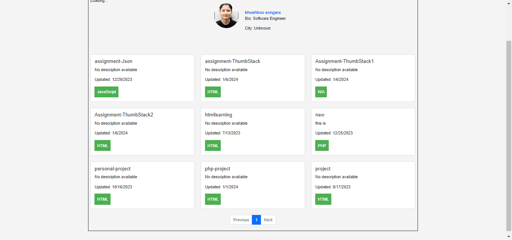
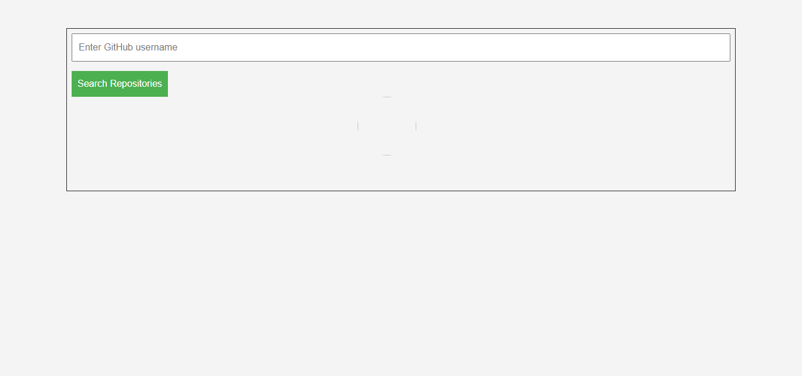

# GitHub Repositories Viewer

A simple web application that allows users to view GitHub repositories. Users can enter a GitHub username, and the application will display the user's information along with their repositories. The repositories are paginated for better navigation.

## Features

- View user information including name, bio, city, and Twitter link (if available).
- Display a list of repositories with details such as repository name, description, last update, and primary language.
- Paginate through repositories for easier navigation.

## Technologies Used

- HTML5
- CSS3
- JavaScript (jQuery)
- Bootstrap 5
- GitHub API

## How to Use

1. Clone the repository:

    ```bash
    git clone https://github.com/your-username/github-repositories-viewer.git
    ```

2. Open `index.html` in  web browser.

3. Enter a GitHub username in the input field and click "Search Repositories."

4. Explore the user's information and repositories.


## Screenshots



Include screenshots of your application here.


## Acknowledgments

- Thanks to [GitHub](https://developer.github.com/v3/) for providing the GitHub API.
- Bootstrap for styling.

